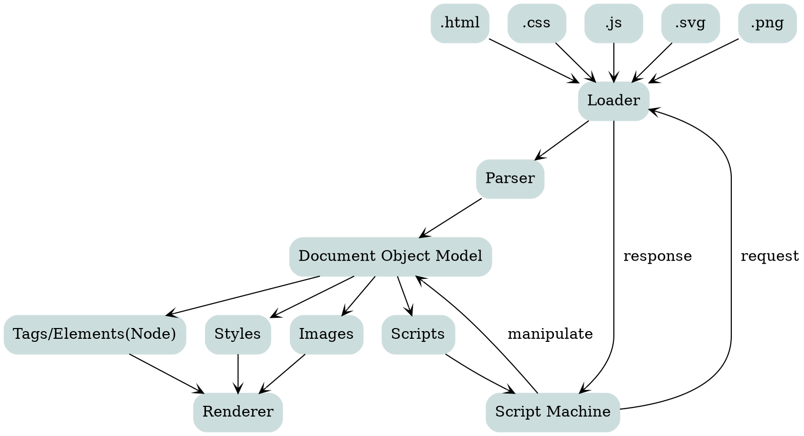

# MDX Test

* Code Highlight
* Graphviz
* $\LaTeX$
* Themes with [Typographic.js](https://kyleamathews.github.io/typography.js/)
* iframe embedding test

## Code Highlight (`gatsby-remark-prismjs`)

```javascript
<html>
<script>
function latex2svg(latex) {

  fetch('/.netlify/functions/latex2svg', {
      method: 'POST',
      body: JSON.stringify(latex),
      headers: new Headers({
        'Content-Type': 'application/json'
      }),
      mode: 'cors' // no-cors, cors, *same-origin
    }).then(response => {
      return response.json();
    }).then(json => {
      container = document.getElementById('svg_container');
      container.innerHTML = json.svg;
    }).catch( error => {
      console.log("Something Wrong");
   });;
}

latex2svg({ "latex" : '\$\$\\LaTeX \\frac{1}{3}\$\$'});
</script>
<body>
    <div id="container">
    </div>
</body>
</html>
```
## $\LaTeX$

$$
\pmatrix{a\\b}\\[5ex]
\pmatrix{c\\d}
$$

<p>
  Lift(<span class="math math-inline">L</span>) can be determined by Lift Coefficient
  (<span class="math math-inline">C_L</span>) like the following equation.
</p>

<div class="math math-display">
  L = \frac{1}{2} \rho v^2 S C_L \\[3ex]  
</div>


## Graphviz (`gatsby-remark-graphviz`)

<center><b>Browser Internals</b></center>



## GeoGeBra Component Test

`src/components/geogebra.js`

<GeoGeBra material_id="uex3vrtm" content_width="600" content_height="550" width="600" height="550" />

```html
<GeoGeBra material_id="uex3vrtm" content_width="600" content_height="550" width="600" height="550" />
```

---