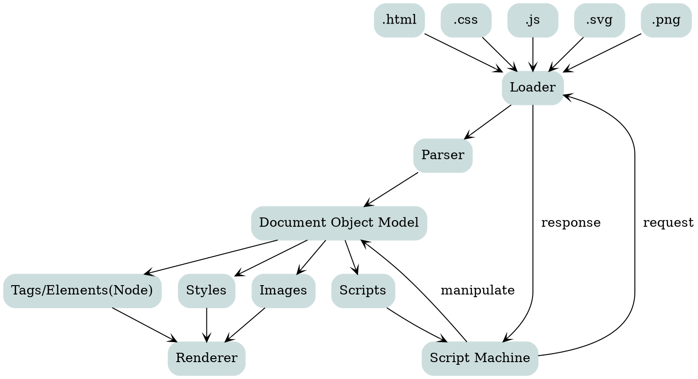

# Test Markdown Page

## Code Highlight

```javascript
<html>
<script>
function latex2svg(latex) {

  fetch('/.netlify/functions/latex2svg', {
      method: 'POST',
      body: JSON.stringify(latex),
      headers: new Headers({
        'Content-Type': 'application/json'
      }),
      mode: 'cors' // no-cors, cors, *same-origin
    }).then(response => {
      return response.json();
    }).then(json => {
      container = document.getElementById('svg_container');
      container.innerHTML = json.svg;
    }).catch( error => {
      console.log("Something Wrong");
   });;
}

latex2svg({ "latex" : '\$\$\\LaTeX \\frac{1}{3}\$\$'});
</script>
<body>
    <div id="container">
    </div>
</body>
</html>
```

## Graphviz

<center><b>Browser Internals</b></center>



## $\LaTeX$ support with $\KaTeX$

    Rodrigues' Rotation Formula

$\def \vk {\hat{k}}
\def \vpara {\vec{v_{\parallel}}}
\def \vperp {\vec{v_{\perp}}}
\def \vv {\vec{v}}
\def \vrot {\vec{v_{rot}}}$

$\begin{cases}
\vk := 轉軸單位向量 \implies |\vk|=1 \\
\vv := 被旋轉的向量 \\
\theta :=旋轉角\\
\vrot := 旋轉後的向量\\
\end{cases}\\[2ex]
\implies
\vrot = \cos{\theta}\ \vv + (1-\cos{\theta})(\vk\cdot \vv)\ \vk\ + \sin{\theta}(\vk\times{\vv})$

## 證明

令 $\begin{cases}\vpara = (\vk\cdot\vv)\ \vk\ \\
\vperp = \vv-\vpara\end{cases}
\iff \vec{v} = \vpara + \vperp$

$\vrot = \vpara + \vec{v_{\perp rot}} \quad(\vpara\ 本身就是轉軸\ \vk\ 的縮放，自不受轉動影響)$

令
$\begin{aligned}
\vec{w} &:= \vk\times{\vperp}，且\ |\vk|=1, \sin\theta=1\implies|\vec{w}| = |\vperp|\\
&= \vk\times(\vv-\vpara) \\
&= \vk\times\vv \quad(\because\vk\times\vpara=0)\\[3ex]
\vec{v_{\perp rot}} &:= \vperp\ 以\ \vperp\ 和\ \vec{w}\ 為平面轉動\ \theta\\
&= \cos{\theta}\ \vperp + \sin{\theta}\ \vec{w}\\
&= \cos{\theta}(\vv - \vpara) + \sin{\theta}(\vk\times\vv)\\
\end{aligned}$

$\begin{aligned}
\vrot &= \vpara + \vec{v_{\perp rot}}\\
&= \vpara + \cos{\theta}(\vv - \vpara) + \sin{\theta}(\vk\times\vv)\\
&=\cos{\theta}\ \vec{v}+(1-\cos{\theta})(\vk\cdot\vv)\ \vk + \sin{\theta}(\vk\times\vv)\ \blacksquare 得證
\end{aligned}$

$若\ v,k\ 固定，則\ (\vk\cdot\vv)\ \vk\ 與\ \vk\times\vv 也是固定的，只需要\ \cos{\theta}\ 與\ \sin{\theta}\ 代入即可很快得到答案。$
 
## 矩陣型式 (Matrix Notation)

寫成矩陣形式，目標是將 $\vec{v}$ 從之前的結果中提出來。
將

$\begin{aligned}
\vec{v_{\perp rot}} &:= \vperp\ 以\ \vperp\ 和\ \vec{w}\ 為平面轉動\ \theta\\
&= \cos{\theta}\ \vperp + \sin{\theta}\ \vec{w}\\
&= \cos{\theta}\ \vperp + \sin{\theta}(\vk\times\vv)
\end{aligned}$
代入
$\begin{aligned}
\vrot &= \vpara + \vec{v_{\perp rot}}\\
&= \vpara + \cos{\theta}\ \vperp + \sin{\theta}(\vk\times\vv) \\
\because\vpara = \vec{v} - \vperp\\
&= (\vv - \vperp) + \cos{\theta}\ \vperp + \sin{\theta}(\vk\times\vv) \\
&= \vv + (\cos{\theta}-1)\ \vperp + \sin{\theta}(\vk\times\vv)\\
\vperp = -(\vk\times(\vk\times\vv))\\
&=\vv + (1-\cos{\theta})(\vk\times(\vk\times\vv)) + \sin{\theta}(\vk\times\vv)\\
\end{aligned}$

$$
\vk := \pmatrix{k_x\\k_y\\k_x} 為單位向量,\ 
\vv := \pmatrix{v_x\\v_y\\v_z}\\
\begin{aligned}
\vk\times\vec{v} &= \pmatrix{k_x\\k_y\\k_x}\times\pmatrix{v_x\\v_y\\v_z}\\[2ex]
&=\pmatrix{k_{y}v_{z}-k_{z}v_{y}\\k_{z}v_{x}-k_{x}v_{z}\\k_{x}v_{y}-k_{y}v_{x}} \\[2ex]
&=\begin{bmatrix}0 & -kz & ky\\kz & 0 & -kx\\-ky & kx & 0\end{bmatrix}\begin{bmatrix}v_x\\v_y\\v_z\end{bmatrix}\\
\end{aligned}
$$

$$
令 K := \begin{bmatrix}0 & -kz & ky\\kz & 0 & -kx\\-ky & kx & 0\end{bmatrix}\\[5ex]
K 其實就是\ \vk\ 對任何向量作外積的矩陣，因此\\ 
\begin{aligned}
\vk\times\vec{v} &= K\ \vv\\
\vk\times(\vk\times\vv) &= \vk\times(K\vv)\\ 
&= K(K\vv)\\
&= K^{2}\vv
\end{aligned}
$$

$$
\begin{aligned}
\therefore
\vec{v_{rot}} &= \vec{v} + (1-\cos{\theta})K^2\vv + \sin{\theta}(K\vec{v})\\[2ex]
&= \underbrace{(I + (1-\cos\theta)K^2 + \sin\theta K)}_\text{R := Rotation Matrix}\ \vv
\end{aligned}
$$
